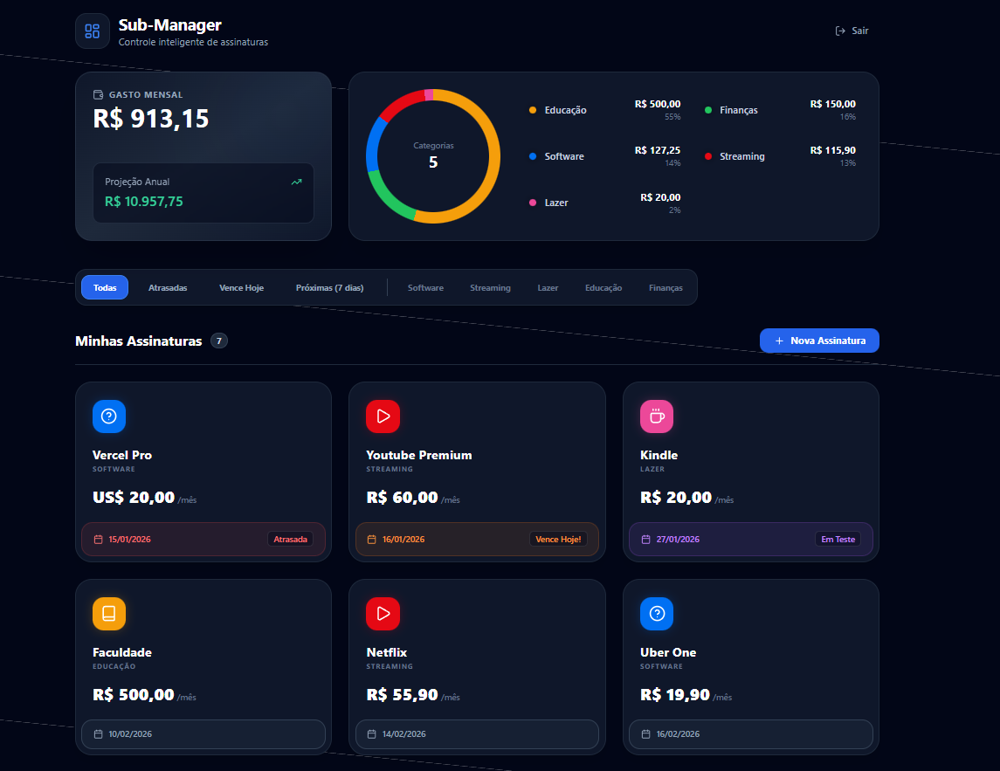

# 💰 Subscription Manager (SaaS Dashboard)

   

> Uma aplicação Full-Stack para gerenciamento inteligente de assinaturas recorrentes, com dashboard financeiro e sistema automatizado de alertas via Discord.




---

## 🚀 Sobre o Projeto

O **Subscription Manager** resolve o problema de esquecer datas de vencimento de assinaturas (Netflix, Spotify, Adobe, etc.). O sistema permite cadastrar serviços, visualizar o custo mensal total e acompanhar status de pagamento.

O diferencial técnico é a integração **Serverless** via **GitHub Actions**, que executa um Cron Job diário para verificar o banco de dados e notificar o usuário no Discord sobre contas vencendo no dia ou no dia seguinte.

## ✨ Funcionalidades Principais

- 📊 **Dashboard Financeiro:** Visualização clara do total gasto mensalmente.
- 🔄 **Gestão de Assinaturas (CRUD):** Adicionar, editar e remover serviços.
- 🎨 **UI/UX Moderno:** Interface responsiva construída com Tailwind CSS e Dark Mode.
- 🔐 **Autenticação Segura:** Login e cadastro de usuários via Supabase Auth.
- 🤖 **Automação de Alertas (DevOps):**
  - Script Node.js roda automaticamente todo dia às 09:00 (GitHub Actions).
  - Verifica vencimentos no Banco de Dados.
  - Envia notificação Push via Webhook para canal privado no Discord.

## 🛠️ Tecnologias Utilizadas

**Frontend:**
- [React.js](https://reactjs.org/) (Vite)
- [TypeScript](https://www.typescriptlang.org/)
- [Tailwind CSS](https://tailwindcss.com/)
- [Lucide React](https://lucide.dev/) (Ícones)

**Backend & Data:**
- [Supabase](https://supabase.com/) (PostgreSQL Database & Auth)
- [Node.js](https://nodejs.org/) (Scripts de Automação)

**DevOps & Tools:**
- [GitHub Actions](https://github.com/features/actions) (CI/CD & Cron Jobs)
- [Discord Webhooks](https://discord.com/developers/docs/resources/webhook)
- [Vercel](https://vercel.com/) (Deploy de Produção)

---

## ⚙️ Arquitetura da Automação

O sistema de alertas funciona de forma totalmente autônoma, sem necessidade de servidor ligado 24h:

```mermaid
graph LR
A[GitHub Actions (Cron)] -- 09:00 AM --> B(Script Node.js)
B -- Query Vencimentos --> C[(Supabase DB)]
C -- Retorna Dados --> B
B -- Payload JSON --> D{Discord Webhook}
D -- Notificação Push --> E[📱 Celular do Usuário]
```

## 🚀 Como Rodar Localmente
### Pré-requisitos
 - **Node.js instalado**

 - **Conta no Supabase**

### Clone este repositório
```bash
$ git clone https://github.com/seu-usuario/sub-manager.git
cd sub-manager
```

### Instale as dependências:
```
$ npm install
```

### Configure as Variáveis de Ambiente: Crie um arquivo .env na raiz e preencha com suas chaves do Supabase:
```
 VITE_SUPABASE_URL=sua_url_do_supabase
 VITE_SUPABASE_ANON_KEY=sua_chave_anonima

 DISCORD_WEBHOOK_URL=seu_webhook_discord (opcional para rodar script local)
```
### Rode o projeto:
```
$ npm run dev
```

## 🤝 Autor
Desenvolvido por Alicia como parte de estudos em Development.